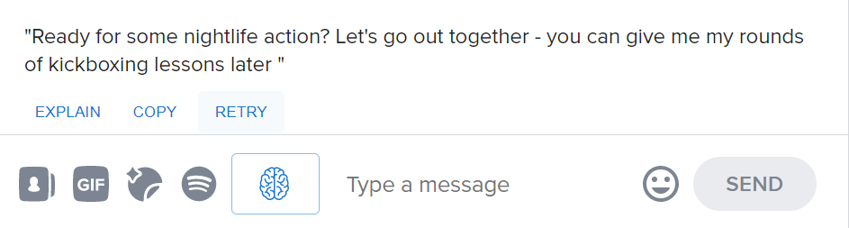

# RizzAI
RizzAI is a Chrome extension that integrates seamlessly into the Tinder web app UI to provide GPT3-powered advice for opening messages based on the match's profile. Provides reasoning and explanations for each line as well.

No guarantees are made on the appropriateness or efficacy of the messages suggested. Use at your own discretion.

## Screenshots

Display of the button beside the message bar

Display of the interface that comes up from above the message bar

